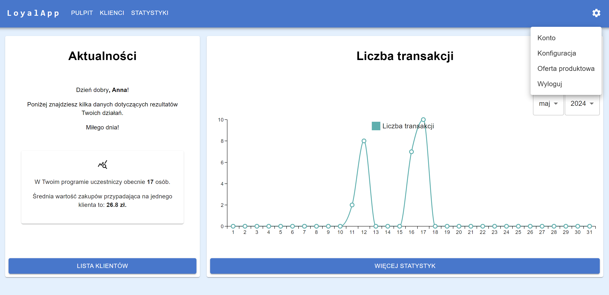
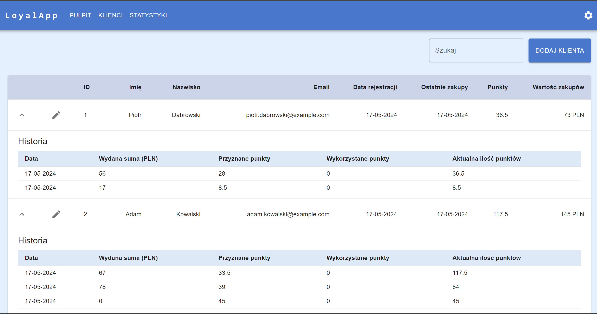
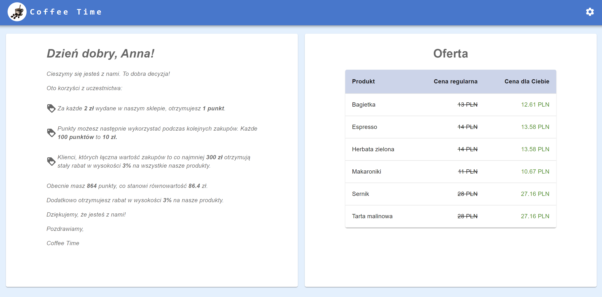

# Loyal-app

## Description

Loyal-app is an application designed to manage loyalty programs based on points accumulation for small brick-and-mortar stores. It consists of an administrator panel and a client panel.

## Demo

Check out the demo [here](https://aniastep.github.io/loyalty-app/#/admin).








## Features

- Login page for administrators (registration is done offline).
- Login and registration pages for clients.
- Administrator panel:
    - Dashboard and basic statistics (placeholder for additional statistics).
    - List of clients - ability to add, remove, and edit client data, including pagination and search functionality.
    - Ability to customize the appearance of the login page, password reset, and client panel by adding the company logo.
    - Dedicated links to login, password reset, and client panel pages for each client.
    - Configuration of the points allocation system.

- Client panel:
    - Dashboard with information about the loyalty program, the number of points collected, and available rewards.
    - Current offers and price list (including any discounts applicable to the client).

## Technologies

- React.js with Hooks
- React Router
- Firebase Firestore
- Firebase Authentication
- Firebase Storage
- Material UI (including MUI X Charts)
- CSS
- RWD (Responsive Web Design)

## Language Version

PL (all messages, including information about validation during form filling, are adapted to Polish users).

## How to Install

To get started with the Loyalty-app project, follow these steps:

1. Clone the repository:

```bash
git clone https://github.com/AniaStep/loyalty-app
```

2. Navigate to the project directory:
```bash
cd loyalty-app
```

3. Install dependencies:
```bash
npm install
```

4. Start the application in development mode:
```bash
npm start
```

5. For production build:
```bash
npm run build
```
In development mode, the localhost server will run on localhost:3000 with auto-reloading.
